# AgriConnect

## Description
AgriConnect est une application mobile .NET MAUI innovante conçue pour connecter directement les agriculteurs locaux aux acheteurs. Elle facilite la vente de produits frais sans intermédiaires, garantissant de meilleurs prix pour les producteurs et des produits de qualité pour les consommateurs.

## Fonctionnalités Principales

### Pour les Acheteurs
- **Catalogue de produits** avec recherche dynamique et filtres
- **Détails complets** des produits (prix, quantité disponible, vendeur, localisation)
- **Panier d'achat** avec gestion des articles et calcul du total
- **Messagerie** pour contacter directement les vendeurs
- **Conseils pour acheteurs** (saison des produits, bonnes pratiques)

### Pour les Agriculteurs
- **Tableau de bord** "Mes Annonces" pour gérer ses produits
- **Ajout de produits** via un formulaire simple (photo, nom, description, prix, quantité)
- **Gestion de stock** avec quantités disponibles

### Fonctionnalités Communes
- **Sélection de rôle** au démarrage (Agriculteur ou Acheteur)
- **Gestion de profil** (modification des informations personnelles)
- **Authentification** avec validation des champs
- **Navigation intuitive** avec barre de navigation inférieure

## Aperçu de l'Application

### 1. Démarrage
| Icône de l'app | Sélection de Rôle | Connexion |
| :---: | :---: | :---: |
| 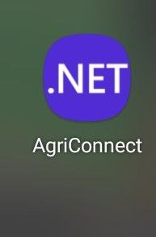 | 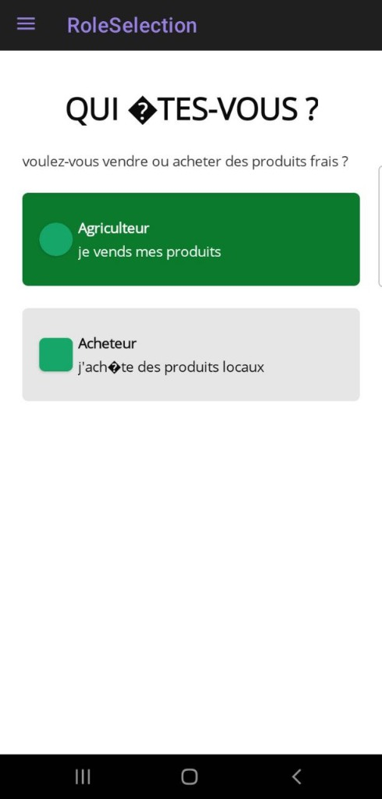 | 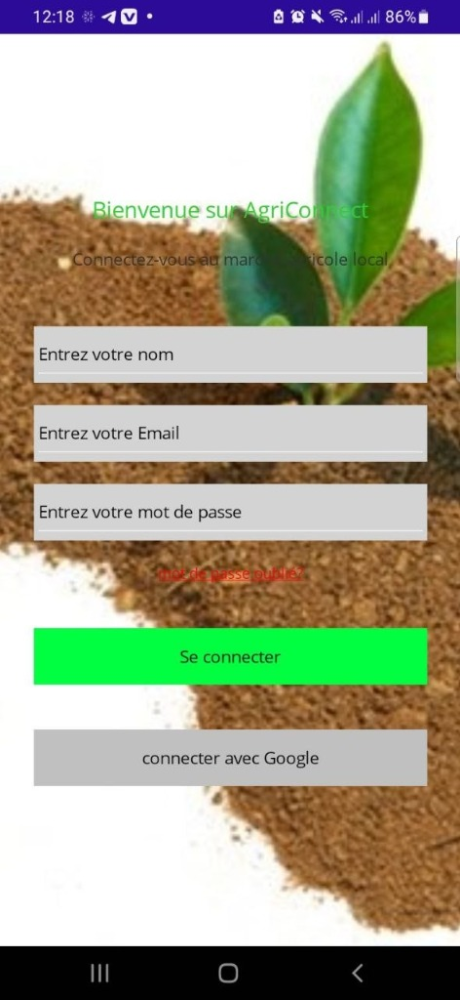 |
| Logo AgriConnect | Choisir entre Agriculteur et Acheteur | Formulaire de connexion |

### 2. Espace Acheteur

#### 2.1 Navigation et Recherche
| Accueil (Catalogue) | Menu Déroulant | Conseils Acheteurs |
| :---: | :---: | :---: |
| 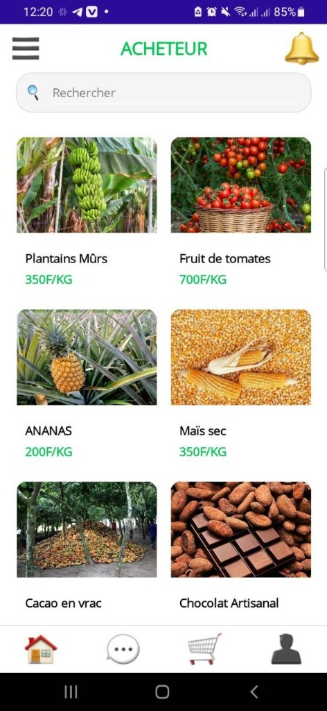 | 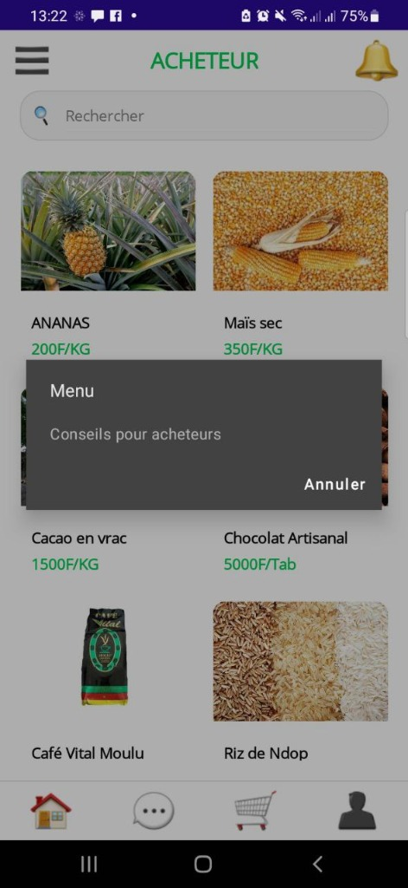 | 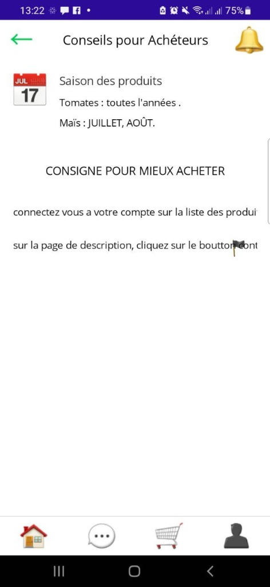 |
| Liste des produits avec recherche | Options du menu | Saison des produits et conseils |

#### 2.2 Produits et Panier
| Détails Produit | Ajout au Panier | Panier |
| :---: | :---: | :---: |
| 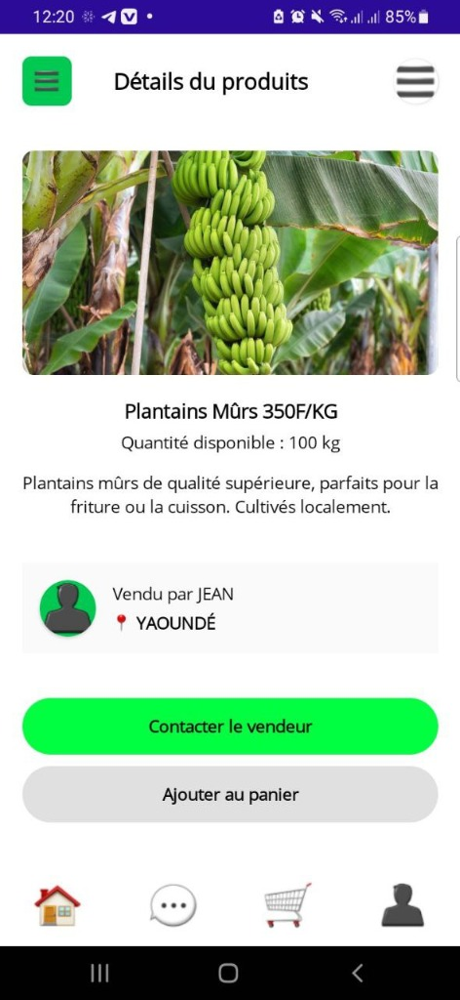 | 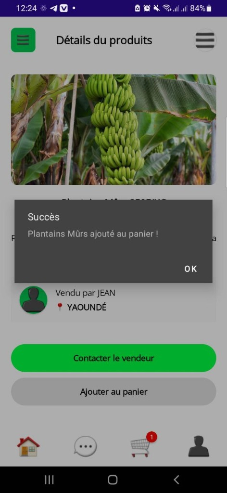 | 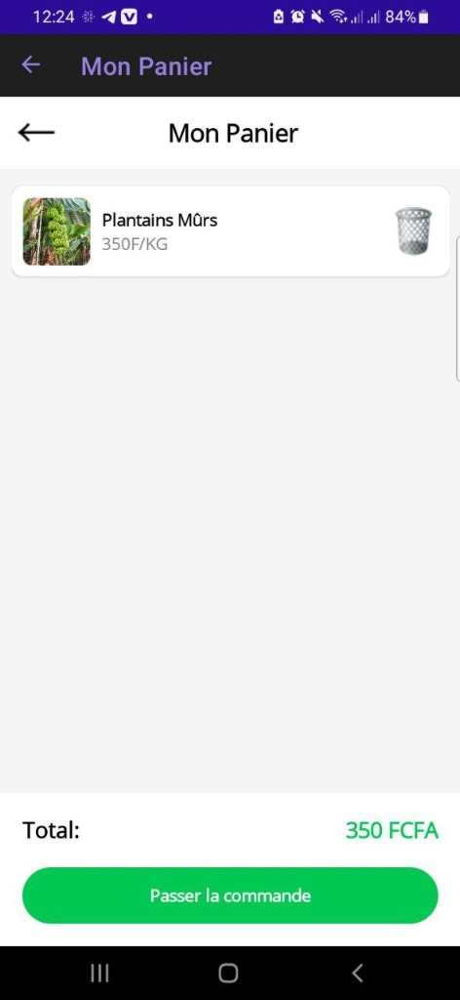 |
| Infos complètes + vendeur | Confirmation d'ajout | Récapitulatif et commande |

#### 2.3 Messagerie et Commandes
| Liste des Discussions | Validation Commande |
| :---: | :---: |
| 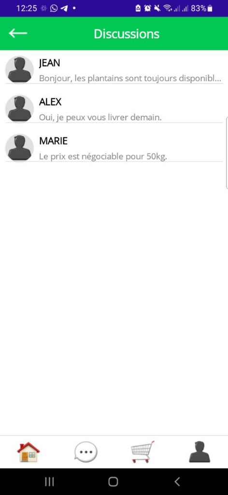 | 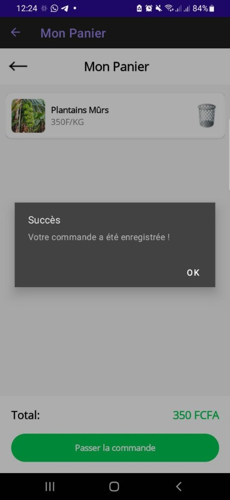 |
| Conversations avec vendeurs | Confirmation de commande enregistrée |

### 3. Espace Agriculteur
| Mes Annonces | Nouvelle Annonce |
| :---: | :---: |
| 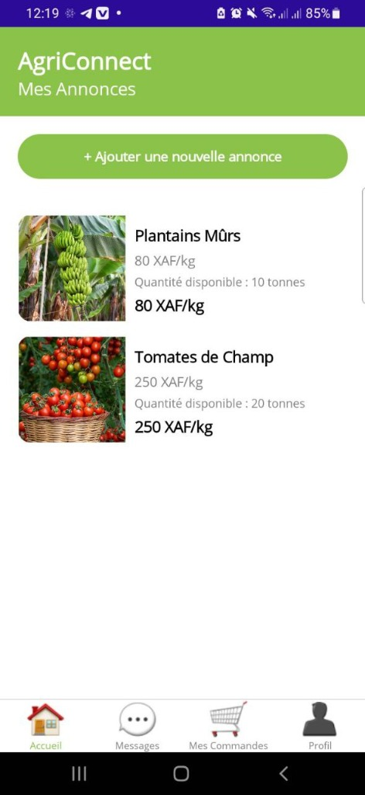 | 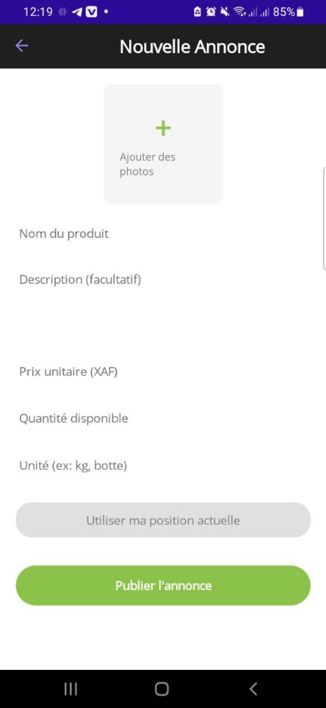 |
| Tableau de bord avec liste de produits | Formulaire d'ajout de produit |

### 4. Gestion de Profil
| Page Profil |
| :---: |
| 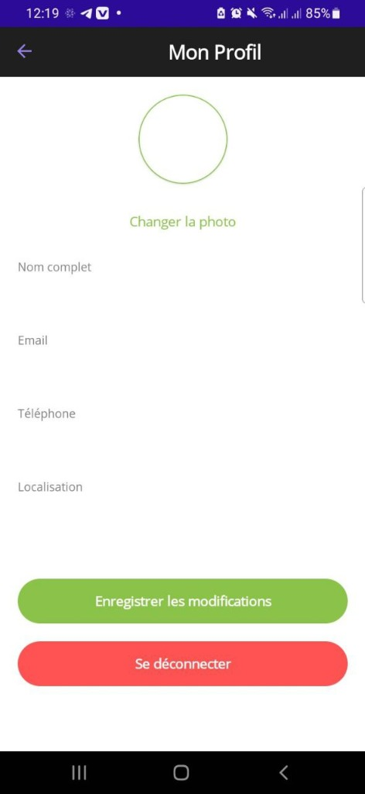 |
| Modification des informations et déconnexion |

## Architecture Technique

### Technologies Utilisées
- **.NET 10 MAUI** - Framework multi-plateforme
- **C#** - Langage de programmation
- **XAML** - Interface utilisateur
- **Shell Navigation** - Système de navigation

### Structure du Projet
```
AgriConnect/
├── Pages/
│   ├── RoleSelectionPage     # Choix du rôle
│   ├── LoginPage              # Authentification
│   ├── ProductsPage           # Catalogue acheteur
│   ├── ProductDetailsPage     # Détails d'un produit
│   ├── FarmerDashboardPage    # Tableau de bord agriculteur
│   ├── AddProductPage         # Ajout de produit
│   ├── ProfilePage            # Gestion du profil
│   ├── CartPage               # Panier
│   ├── ChatListPage           # Liste des discussions
│   ├── ChatPage               # Conversation
│   └── BuyerAdvicePage        # Conseils acheteurs
├── Services/
│   └── CartService.cs         # Gestion du panier
├── Converters/
│   └── IntToBoolConverter.cs  # Convertisseur pour badge
├── Models/
│   └── Product.cs             # Modèle de données produit
└── Resources/
    └── Images/                # Images des produits
```

## Guide d'Installation

### Prérequis
- **Visual Studio 2022** (version 17.8 ou supérieure)
- Charge de travail **".NET Multi-platform App UI development"**
- **Android SDK** (configuré automatiquement via Visual Studio)
- **.NET 10 SDK**

### Étapes d'Installation

1. **Cloner ou télécharger le projet**
   ```bash
   git clone [votre-repo-url]
   cd AgriConnect
   ```

2. **Ouvrir la solution**
   - Ouvrez `AgriConnect.sln` dans Visual Studio 2022

3. **Restaurer les packages NuGet**
   - Visual Studio le fait automatiquement, ou manuellement :
   ```powershell
   dotnet restore
   ```

4. **Choisir la plateforme cible**
   - Sélectionnez `net10.0-android` dans la barre d'outils
   - Choisissez un émulateur Android ou un appareil physique connecté en USB

5. **Lancer l'application**
   - Appuyez sur **F5** ou cliquez sur le bouton **Play**
   - L'application se compile et se déploie automatiquement

### Générer un APK pour Distribution

Pour créer un fichier APK installable sur n'importe quel téléphone Android :

1. Ouvrez un terminal PowerShell dans le dossier du projet :
   ```powershell
   cd C:\Users\[VotreNom]\source\repos\AgriConnect\AgriConnect
   ```

2. Exécutez la commande de publication :
   ```powershell
   dotnet publish -f net10.0-android -c Release
   ```

3. Récupérez l'APK généré :
   - Chemin : `bin\Release\net10.0-android\publish\`
   - Fichier : `com.companyname.agriconnect-Signed.apk`

4. Transférez le fichier APK sur votre téléphone et installez-le
   - Activez "Sources inconnues" dans les paramètres Android si nécessaire

## Utilisation de l'Application

### Premier Lancement
1. **Sélection du rôle** : Choisissez "Agriculteur" ou "Acheteur"
2. **Connexion** : Entrez vos informations (nom, email, mot de passe)
   - *Note : Pour cette démo, toutes les informations sont acceptées*

### En tant qu'Acheteur
1. **Explorer les produits** : Parcourez le catalogue sur la page d'accueil
2. **Rechercher** : Utilisez la barre de recherche pour filtrer les produits
3. **Voir les détails** : Cliquez sur un produit pour voir ses informations complètes
4. **Ajouter au panier** : Cliquez sur "Ajouter au panier" depuis la page de détails
5. **Passer commande** : Accédez au panier via l'icône en bas, puis "Passer la commande"
6. **Consulter les conseils** : Menu (☰) → "Conseils pour acheteurs"

### En tant qu'Agriculteur
1. **Voir vos annonces** : Le tableau de bord affiche vos produits publiés
2. **Ajouter un produit** : Cliquez sur "+ Ajouter une nouvelle annonce"
3. **Remplir le formulaire** : Ajoutez photo, nom, description, prix, quantité
4. **Publier** : Cliquez sur "Publier l'annonce"

### Gestion du Profil
- Cliquez sur l'icône **Profil** (👤) en bas à droite
- Modifiez vos informations personnelles
- Utilisez "Se déconnecter" pour revenir à la sélection de rôle

## Fonctionnalités Implémentées

### ✅ Terminé
- [x] Sélection de rôle (Agriculteur/Acheteur)
- [x] Authentification avec validation
- [x] Navigation basée sur le rôle
- [x] Catalogue de produits avec 9 produits
- [x] Recherche dynamique
- [x] Détails de produit complets
- [x] Panier d'achat fonctionnel
- [x] Badge de notification sur le panier
- [x] Dashboard agriculteur
- [x] Formulaire d'ajout de produit
- [x] Page de profil
- [x] Interface de messagerie
- [x] Page de conseils pour acheteurs

### 🔄 En Cours / Améliorations Futures
- [ ] Connexion avec backend réel
- [ ] Upload de photos produits via caméra/galerie
- [ ] Messagerie en temps réel
- [ ] Géolocalisation des agriculteurs
- [ ] Système de notation/avis
- [ ] Historique des commandes
- [ ] Notifications push

## État du Projet

Ce projet est une **preuve de concept (POC)** fonctionnelle qui démontre :
- ✅ **Architecture MVVM** bien structurée
- ✅ **Navigation Shell** complète avec routes
- ✅ **Données simulées** (Mock Data) pour démonstration
- ✅ **Interface utilisateur** responsive et moderne
- ✅ **Gestion d'état** avec Services et BindingContext
- ✅ **Validation de formulaires**
- ✅ **Navigation conditionnelle** basée sur le rôle

## Contribution

Pour contribuer au projet :
1. Forkez le repository
2. Créez une branche pour votre fonctionnalité (`git checkout -b feature/nouvelle-fonctionnalite`)
3. Commitez vos changements (`git commit -m 'Ajout de...'`)
4. Pushez vers la branche (`git push origin feature/nouvelle-fonctionnalite`)
5. Ouvrez une Pull Request

## Licence

Ce projet est développé à des fins éducatives et de démonstration.

---

**Développé avec ❤️ en .NET MAUI**

*Pour toute question ou problème, ouvrez une issue sur GitHub.*